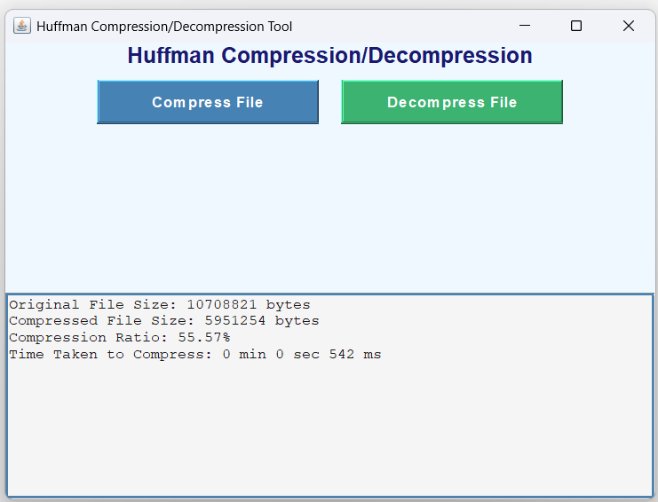

# File-Compression-and-Decompression-System
## ✅ 1. What is it?
This is a Java-based GUI application that implements **Huffman Coding**, a lossless data compression algorithm. The app allows users to:

- Compress text files (`.txt`) into smaller binary files.
- Decompress binary files (`.bin`) back into their original text.

It’s designed with a user-friendly interface using **Java Swing**, making file compression and decompression easy for users without any command-line interaction.

---

## ✅ 2. Features

- 📁 **File Compression**: Compresses any `.txt` file using Huffman encoding and saves as `.bin`.
- 🧾 **File Decompression**: Decompresses `.bin` files and restores the original `.txt`.
- 📊 **Compression Statistics**:
  - Original vs Compressed file size.
  - Compression ratio in percentage.
  - Time taken for compression/decompression (in min/sec/ms).
- 🧠 **Efficient Huffman Tree Construction**:
  - Min-heap based tree generation.
  - Frequency table creation for unique characters.
- 📄 **Real-Time Logs**: Outputs detailed log in a styled text area within the GUI.
- 🖥️ **Interactive GUI**: Built using Java Swing, with styled buttons, scrollable text area, and file chooser.

---

## ✅ 3. Working

### 🔹 Compression Process:
1. User selects a `.txt` file using file chooser.
2. App reads the file and builds a frequency table of characters.
3. It constructs a Huffman Tree using a min-heap.
4. Huffman codes are generated for each character.
5. File content is encoded into binary format using the Huffman codes.
6. Binary output along with metadata (codes/frequency) is written to a `.bin` file.
7. The app shows:
   - File sizes
   - Compression ratio
   - Time taken

### 🔹 Decompression Process:
1. User selects a `.bin` file using file chooser.
2. App reads metadata (character-frequency pairs).
3. It reconstructs the Huffman Tree.
4. It decodes the binary file using the tree and restores the original text.
5. The decompressed text is saved as `decompressed.txt`.

---

## 📸 4. Screenshot

## ✅ 5. Technologies Used

| Technology                | Purpose                                      |
|---------------------------|----------------------------------------------|
| **Java**                  | Core programming language                    |
| **Java Swing**            | GUI creation and event handling              |
| **File I/O (java.io)**    | Reading/writing files, buffered operations   |
| **Data Streams**          | Writing binary data efficiently (`.bin`)     |
| **Huffman Coding**        | Core compression algorithm (custom logic)    |
| **Min-Heap**              | Efficient Huffman Tree building              |
| **BufferedReader/Writer** | Efficient character-based file access        |
| **JFileChooser**          | Allow users to browse/select files from system |

---

## 📌 Author
Developed by *Yash Dixit*.
